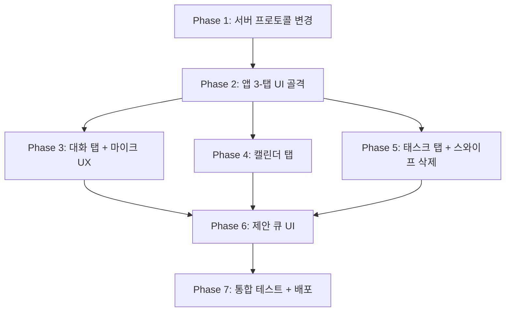

# HomeAssistant v2 — 제안 기반 일정 관리 시스템 재설계

## 배경

현재 시스템은 음성 → STT → AI → **즉시 적용**의 흐름이다. 이것을 음성 → STT → AI → **제안 생성** → 사용자 확인 → 적용으로 바꾸는 것이 핵심.

핵심 사용성 원칙:
- **"터치 한 번 수준"**: 마이크 on/off 하나로 끝나야 함
- **"알아서 정리 못하면 메모를 쓰지"**: AI가 구조화된 제안을 알아서 만들어야 함
- 제안들은 쌓아놨다가 **앱을 켤 때 몰아서 처리** (매번 팝업 X)

---

## User Review Required

> [!IMPORTANT]
> **캘린더 2개 유지 vs 캘린더 1개로 단순화**
> 현재 calendar_1, calendar_2로 나뉘어 있는데, 요구사항에서는 "캘린더 일정"과 "비캘린더 일정"으로만 구분합니다. 캘린더를 1개로 합칠지, 기존 2개를 유지할지 결정이 필요합니다.
> → **이 계획에서는 기존 2개 캘린더를 유지하되**, 앱 UI에서는 하나의 "캘린더" 탭에 합쳐서 보여주는 방식으로 진행합니다.

> [!WARNING]
> **즉시 적용 vs 제안 후 수락 모드 선택**
> 요구사항에는 "accept → 알아서 정리"라는 흐름이 있지만, 핵심 사용성이 "터치 한 번"입니다.
> 제안을 하나하나 수락하는 것이 부담이 될 수 있으므로, **기본적으로 즉시 적용 + 되돌리기(undo)** 방식도 대안이 될 수 있습니다.
> → **이 계획에서는 요구사항대로 제안 큐 방식**으로 진행합니다. 단, "모두 수락" 버튼으로 원터치 처리를 가능하게 합니다.

---

## Open Questions

> [!IMPORTANT]
> **비캘린더 태스크 완료 처리는 어떻게?**
> 현재 `complete_task` 액션이 있는데, 스와이프로 삭제만 할 건지, 완료 표시 → 나중에 정리도 할 건지?
> → 이 계획에서는 **스와이프 = 즉시 삭제** (완료 표시 없이)로 구현합니다.

> [!NOTE]
> **대화 기록 저장 범위**
> 대화 화면에서 STT 입력과 AI 응답을 보여줘야 하는데, 이 기록을 서버에 저장할지 앱 로컬에만 저장할지?
> → 서버 `schedule.json`에 최근 N개 대화 기록을 포함시키는 방식으로 진행합니다.

---

## Proposed Changes

### 1. 서버 — AI 프로토콜 재설계

#### [MODIFY] [home_voice_server.py](file:///c:/Users/ppggh/.antigravity-ide/HomeAssistant/server/home_voice_server.py)

**1-1. 새로운 AI 응답 스키마 (8가지 action)**

```json
{
  "action": "propose_add_event | propose_add_task | propose_delete_event | propose_delete_task | query_events | query_tasks | question | message",
  "calendar": "calendar_1 | calendar_2",
  "title": "...",
  "date": "YYYY-MM-DD",
  "start_time": "HH:MM",
  "end_time": "HH:MM",
  "memo": "...",
  "id": "삭제 시 대상 이벤트/태스크 id",
  "message": "사용자에게 표시할 한국어 메시지"
}
```

기존 `add_event`, `delete_event` 등은 **즉시 적용**이었지만, 새로운 `propose_*` 액션들은 **제안 큐에 추가**만 한다.

**1-2. 제안 큐(Proposal Queue) 추가**

`schedule.json` 구조 변경:
```json
{
  "calendars": { "calendar_1": [...], "calendar_2": [...] },
  "tasks": [...],
  "proposals": [
    {
      "proposal_id": "p-20260529-abc123",
      "action": "add_event",
      "calendar": "calendar_1",
      "title": "회의",
      "date": "2026-06-02",
      "start_time": "10:00",
      "message": "6월 2일 오전 10시에 회의 추가할까요?",
      "created_at": "2026-05-29T19:00:00"
    }
  ],
  "chat_history": [
    { "role": "user", "text": "다음주 월요일 10시에 회의 잡아줘", "timestamp": "..." },
    { "role": "ai", "action": "propose_add_event", "message": "...", "timestamp": "..." }
  ],
  "updated_at": "..."
}
```

**1-3. 새로운 API 엔드포인트**

| 엔드포인트 | 메서드 | 설명 |
|-----------|--------|------|
| `GET /schedule` | GET | 현재 일정 + 대기 중 제안 + 대화 기록 반환 |
| `POST /command` | POST | 텍스트 명령 → AI 처리 → 제안 생성 |
| `POST /stt-command` | POST | WAV 업로드 → STT → AI 처리 → 제안 생성 |
| `POST /proposal/accept` | POST | `{"proposal_id": "..."}` → 제안 적용 |
| `POST /proposal/reject` | POST | `{"proposal_id": "..."}` → 제안 제거 |
| `POST /proposal/accept-all` | POST | 모든 대기 제안 일괄 적용 |
| `DELETE /task/{id}` | DELETE | 태스크 직접 삭제 (스와이프) |
| `DELETE /event/{id}` | DELETE | 이벤트 직접 삭제 |
| `POST /event` | POST | 이벤트 수동 추가 |
| `POST /task` | POST | 태스크 수동 추가 |

**1-4. 시스템 프롬프트 개선**

- 오늘 날짜 + 현재 요일을 매번 주입
- AI가 `propose_*`를 반환하도록 프롬프트 변경
- `query_events`, `query_tasks`는 현재 상태를 요약해서 message에 담아 반환
- `question`은 날짜 정보 누락 등 애매한 경우 되묻기
- `message`는 단순 답변 (날씨 등 일정과 무관한 질문)

**1-5. 지난 캘린더 이벤트 자동 정리**

기존 `_is_current_or_future_event`를 수정하여 **2주 지난 이벤트**만 삭제:
```python
def _is_current_or_future_event(self, event, today):
    event_date = self._parse_date(str(event.get("date") or ""))
    if event_date is not None:
        return (today - event_date).days <= 14  # 2주까지 유지
    # 날짜 없는 이벤트는 created_at 기준 2주
    created_date = self._parse_datetime_date(str(event.get("created_at") or ""))
    return created_date is None or (today - created_date).days <= 14
```

---

### 2. 앱 — 3-탭 UI 아키텍처

#### [MODIFY] [MainActivity.java](file:///c:/Users/ppggh/.antigravity-ide/HomeAssistant/app/src/main/java/com/example/homeassistantvoice/MainActivity.java)

현재 단일 ScrollView를 **3-탭 구조**로 전면 재설계:

**탭 1: 💬 대화 (Chat)**
- 상단에 대화 기록 표시 (STT 텍스트 + AI 응답을 읽기 편하게 변환)
  - AI의 JSON 응답을 변환: `{"action":"propose_add_task", "title":"abc"}` → `[비캘린더] "abc" 일정 추가를 제안합니다.`
- 하단에 **마이크 버튼** (플로팅, 원터치)
  - 터치 → 녹음 시작, 다시 터치 → 녹음 종료 + 서버 전송
- 텍스트 입력도 가능 (접힌 상태로 둠)

**탭 2: 📅 캘린더 (Calendar)**
- calendar_1 + calendar_2 이벤트를 날짜순으로 통합 표시
- 각 이벤트 카드: 날짜, 시간, 제목, 메모
- 수동 추가/삭제 버튼
- 지난 이벤트는 흐리게 표시 (2주 이내)

**탭 3: 📋 태스크 (Tasks)**
- 비캘린더 태스크 순차 목록
- **스와이프 왼쪽 → 즉시 삭제** (핵심 UX)
- 수동 추가 가능
- `ItemTouchHelper`로 스와이프 구현

**제안 알림 배지**
- 대기 중인 제안 수를 탭 바 또는 상단에 배지로 표시
- 탭 어디에서든 "제안 N건" 클릭 → 제안 목록 팝업
- "모두 수락" / 개별 수락·거절 가능

**UI 구성 방식**
- 프로그래매틱 View 유지 (XML 레이아웃 없이 Java 코드에서 생성)
- `ViewFlipper` 또는 수동 visibility toggle로 탭 전환
- 하단에 3개 탭 버튼 바

---

### 3. 앱 — 스와이프 삭제 구현

#### [MODIFY] [MainActivity.java](file:///c:/Users/ppggh/.antigravity-ide/HomeAssistant/app/src/main/java/com/example/homeassistantvoice/MainActivity.java)

태스크 목록을 `RecyclerView` + `ItemTouchHelper.SimpleCallback`으로 구현:

```java
// 스와이프 왼쪽 → 삭제
ItemTouchHelper.SimpleCallback swipeCallback = new ItemTouchHelper.SimpleCallback(0, ItemTouchHelper.LEFT) {
    @Override
    public void onSwiped(RecyclerView.ViewHolder viewHolder, int direction) {
        int position = viewHolder.getAdapterPosition();
        String taskId = taskAdapter.getTaskId(position);
        taskAdapter.removeItem(position);
        // 서버에 DELETE /task/{id} 요청
        queue.execute(() -> deleteTask(taskId));
    }
};
new ItemTouchHelper(swipeCallback).attachToRecyclerView(taskRecyclerView);
```

빨간 배경 + 휴지통 아이콘이 스와이프 시 보이도록 `onChildDraw` 커스텀.

---

### 4. 앱 — 마이크 원터치 UX 개선

#### [MODIFY] [MicService.java](file:///c:/Users/ppggh/.antigravity-ide/HomeAssistant/app/src/main/java/com/example/homeassistantvoice/MicService.java)

현재와 동일한 위젯 토글 방식 유지하되:
- 녹음 종료 후 서버 응답에서 `proposals` 필드가 있으면 제안 큐에 추가
- TTS로 AI의 `message`를 읽어줌
- 앱이 포그라운드면 제안 배지 업데이트 broadcast

---

### 5. 앱 — 대화 기록 표시 (JSON → 사람이 읽기 편한 텍스트)

#### [NEW] ChatMessageRenderer.java

AI 응답 JSON을 사용자 친화적 텍스트로 변환하는 유틸리티:

```java
public class ChatMessageRenderer {
    public static String render(JSONObject aiResponse) {
        String action = aiResponse.optString("action", "");
        String title = aiResponse.optString("title", "");
        String message = aiResponse.optString("message", "");

        switch (action) {
            case "propose_add_event":
                String date = aiResponse.optString("date", "");
                String time = aiResponse.optString("start_time", "");
                return String.format("[캘린더] %s %s에 \"%s\" 추가를 제안합니다.", date, time, title);
            case "propose_add_task":
                return String.format("[비캘린더] \"%s\" 추가를 제안합니다.", title);
            case "propose_delete_event":
                return String.format("[캘린더] \"%s\" 삭제를 제안합니다.", title);
            case "propose_delete_task":
                return String.format("[비캘린더] \"%s\" 삭제를 제안합니다.", title);
            case "question":
                return String.format("질문: %s", message);
            case "message":
            default:
                return message;
        }
    }
}
```

---

### 6. 전체 파일 변경 요약

| 파일 | 변경 | 설명 |
|------|------|------|
| [home_voice_server.py](file:///c:/Users/ppggh/.antigravity-ide/HomeAssistant/server/home_voice_server.py) | MODIFY | 제안 큐, 새 엔드포인트, 프롬프트 개선, 2주 자동정리 |
| [MainActivity.java](file:///c:/Users/ppggh/.antigravity-ide/HomeAssistant/app/src/main/java/com/example/homeassistantvoice/MainActivity.java) | MODIFY | 3-탭 UI, 제안 배지, RecyclerView 태스크 목록, 스와이프 삭제 |
| [MicService.java](file:///c:/Users/ppggh/.antigravity-ide/HomeAssistant/app/src/main/java/com/example/homeassistantvoice/MicService.java) | MODIFY | 제안 응답 처리, 배지 업데이트 broadcast |
| ChatMessageRenderer.java | NEW | AI JSON → 사람 텍스트 변환 |
| TaskAdapter.java | NEW | RecyclerView 어댑터 (스와이프 삭제 지원) |
| EventAdapter.java | NEW | RecyclerView 어댑터 (캘린더 이벤트 표시) |
| ProposalAdapter.java | NEW | RecyclerView 어댑터 (제안 목록 수락/거절) |

---

## 구현 순서



| Phase | 예상 시간 | 내용 |
|-------|----------|------|
| 1 | 2시간 | 서버: 제안 큐, 새 엔드포인트, 프롬프트 변경, 2주 자동정리 |
| 2 | 1시간 | 앱: 탭 바 + ViewFlipper 골격, 다크 테마 |
| 3 | 1.5시간 | 대화 탭: 기록 표시, 마이크 버튼, JSON→텍스트 변환 |
| 4 | 1시간 | 캘린더 탭: 통합 이벤트 목록, 수동 추가/삭제 |
| 5 | 1.5시간 | 태스크 탭: RecyclerView, 스와이프 삭제, 수동 추가 |
| 6 | 1시간 | 제안 큐: 배지, 제안 리스트, 모두 수락 |
| 7 | 1시간 | 통합 테스트, 빌드, 배포 |

**총 예상: ~9시간**

---

## Verification Plan

### Automated Tests
```bash
# 서버 단위 테스트 (Python)
python -m pytest server/test_home_voice_server.py -v

# 서버 수동 테스트
curl -X POST http://localhost:8001/command -H "Content-Type: application/json" -d '{"command":"다음주 월요일 10시에 회의"}'
# → proposals 배열에 제안이 추가되는지 확인

curl -X POST http://localhost:8001/proposal/accept -H "Content-Type: application/json" -d '{"proposal_id":"p-xxx"}'
# → calendars에 이벤트가 추가되는지 확인

curl -X DELETE http://localhost:8001/task/task-id-123
# → tasks에서 삭제되는지 확인
```

### Manual Verification
- 앱 빌드 → 실기기 설치 → 3탭 전환 확인
- 마이크 원터치 녹음 → 서버 응답 → 대화 탭에 표시 확인
- 태스크 스와이프 삭제 동작 확인
- 제안 "모두 수락" 후 캘린더/태스크에 반영 확인
- 2주 지난 캘린더 이벤트 자동 삭제 확인
